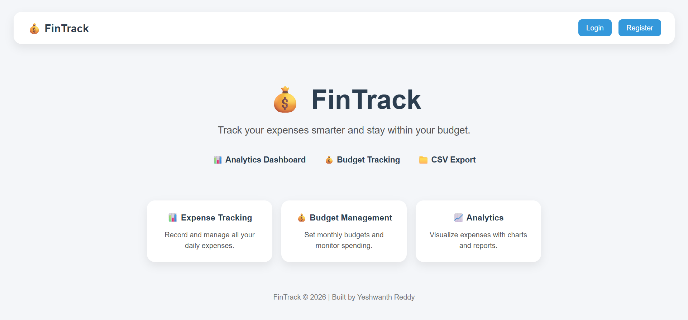
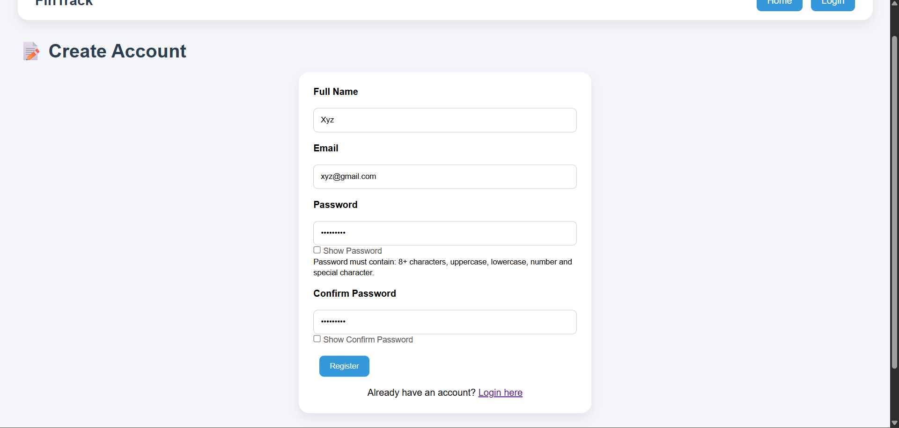
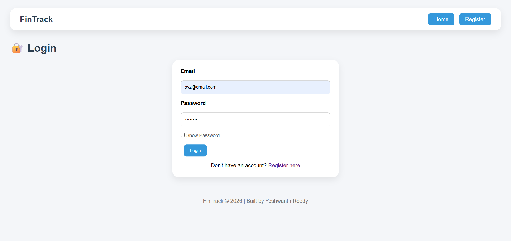
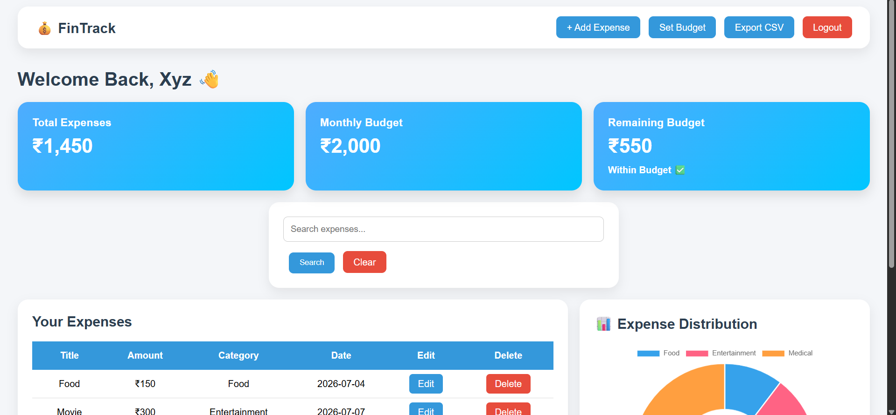
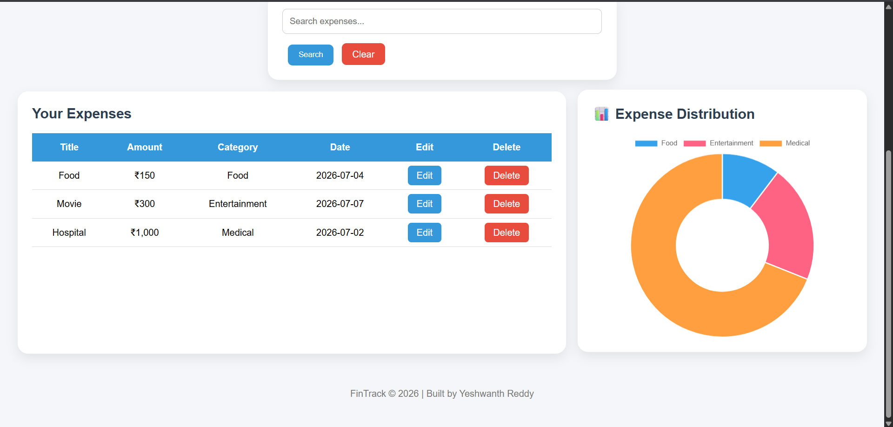
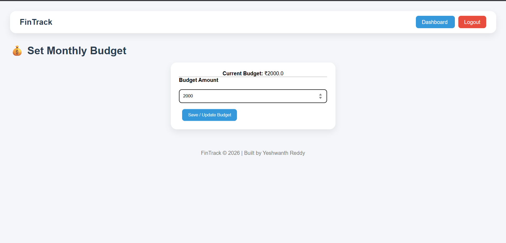

# 💰 FinTrack - Expense Tracker with Analytics

FinTrack is a full-stack web application that helps users track daily expenses, manage budgets, and visualize spending patterns through an interactive dashboard.

## ✨ Highlights

- Full-Stack Expense Tracking Application
- Secure Authentication with Password Hashing
- PostgreSQL Cloud Database
- Interactive Analytics Dashboard
- CSV Export Functionality
- Deployed on Render

## 🚀 Live Demo

🔗 https://fintrack-eevd.onrender.com

---

## 📌 Features

### 👤 User Authentication
- User Registration
- Secure Login
- Password Hashing
- Session Management
- Logout Functionality

### 💸 Expense Management
- Add Expenses
- Edit Expenses
- Delete Expenses
- Search Expenses
- Category-wise Expense Tracking

### 📊 Analytics Dashboard
- Total Expense Calculation
- Budget Tracking
- Remaining Budget Calculation
- Category-wise Charts using Chart.js

### 📁 Export
- Export Expenses as CSV

---

## 🛠️ Tech Stack

### Backend
- Python
- Flask

### Database
- PostgreSQL

### Frontend
- HTML
- CSS
- Jinja2 Templates

### Visualization
- Chart.js

### Deployment
- Render

---

## 📂 Project Structure

```text
ExpenseTracker/
│
├── app.py
├── db.py
├── requirements.txt
├── Procfile
├── .gitignore
│
├── static/
│   └── css/
│       └── style.css
│
└── templates/
    ├── home.html
    ├── login.html
    ├── register.html
    ├── dashboard.html
    ├── add_expense.html
    ├── edit_expense.html
    └── set_budget.html
```

---

## ⚙️ Installation

### Clone Repository

```bash
git clone https://github.com/yeshwanthreddynandigala-hub/FinTrack.git
cd FinTrack
```

### Create Virtual Environment

```bash
python -m venv venv
```

Activate:

```bash
venv\Scripts\activate
```

### Install Dependencies

```bash
pip install -r requirements.txt
```

### Create Environment Variables

Create a `.env` file:

```env
DATABASE_URL=your_postgresql_database_url
SECRET_KEY=your_secret_key
```

### Run Application

```bash
python app.py
```

---

## 📸 Screenshots

### Home Page



### Register Page



### Login Page



### Dashboard






### Budget Management




---

## 🔮 Future Improvements

- Dark Mode
- Monthly Reports
- Expense Categories Insights
- Email Verification
- Password Reset
- PDF Reports
- Mobile Responsive Design Improvements

---

## 👨‍💻 Author

**Yeshwanth Reddy**

- GitHub: https://github.com/yeshwanthreddynandigala-hub
- LinkedIn: https://www.linkedin.com/in/yeshwanthreddynandigala/
- Portfolio Project: FinTrack

---

## 📄 License

This project is created for learning and portfolio purposes.

---

## ⭐ If you like this project

Give it a star on GitHub!